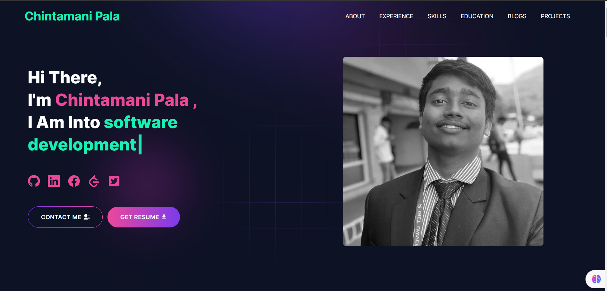

# Personal Portfolio

### This portfolio is created by chintamani pala, if iyou want to add any section then feel free to contact me on chintamanipala67@gmail.com.

---

# Demo :movie_camera:



## View live preview [here](https://chintamanipala.in/).

---

## Table of Contents :scroll:

- [Sections](#sections-bookmark)
- [Demo](#demo-movie_camera)
- [Installation](#installation-arrow_down)
- [Getting Started](#getting-started-dart)
- [Usage](#usage-joystick)

---

# Sections :bookmark:

- HERO SECTION
- ABOUT ME
- EXPERIENCE
- SKILLS
- PROJECTS
- EDUCATION
- BLOG
- CONTACTS

---

# Installation :arrow_down:

### You will need to download Git and Node to run this project

- [Git](https://git-scm.com/downloads)
- [Node](https://nodejs.org/en/download/)

#### Make sure you have the latest version of both Git and Node on your computer.

```
node --version
git --version
```

## <br />

# Getting Started :dart:

### Fork and Clone the repo

To Fork the repo click on the fork button at the top right of the page. Once the repo is forked open your terminal and perform the following commands

```
git clone https://github.com/<YOUR GITHUB USERNAME>/developer-portfolio.git

cd developer-portfolio
```

### Install packages from the root directory

```bash
npm install
# or
yarn install
```

Then, run the development server:

```bash
npm run dev
# or
yarn dev
```

Open [http://localhost:3000](http://localhost:3000) with your browser to see the result.

---

# Usage :joystick:

Goto [emailjs.com](https://www.emailjs.com/) and create a new account for the mail sending. In free trial you will get 200 mail per month. After setup `emailjs` account, Please create a new `.env` file from `.env.example` file.

Eg:

```env
NEXT_PUBLIC_EMAILJS_SERVICE_ID =
NEXT_PUBLIC_EMAILJS_TEMPLATE_ID =
NEXT_PUBLIC_EMAILJS_PUBLIC_KEY =
NEXT_PUBLIC_GTM = # For site analytics
NEXT_PUBLIC_APP_URL = "http://127.0.0.1:3000"
NEXT_PUBLIC_RECAPTCHA_SECRET_KEY = # For captcha verification on contact form
NEXT_PUBLIC_RECAPTCHA_SITE_KEY =
```

### Then, Customize data in the `utils/data` [folder](https://github.com/chintamani-pala/personal-portfolio/tree/main/utils/data).

Eg:

```javascriptexport 
const personalData = {
  name: "Chintamani Pala",
  profile: '/profile.png',
  profile2: '/profile2.png',
  profession:["frontend development", "backend development", "Full stack web development", "software development"],
  description: "Hey there! I'm Chintamani Pala, a dedicated programmer driven by passion and curiosity. With an insatiable thirst for knowledge, I embrace every opportunity to learn and grow. Exploring the vast realm of technology is my playground, and I thrive on the challenge of solving complex problems. As a versatile developer, I revel in the diversity of web application development stacks, constantly pushing boundaries to create innovative solutions. JavaScript is my trusted companion in this journey, empowering me to build dynamic and impactful projects across the digital landscape.",
  email: 'chintamanipala67@gmail.com',
  phone: '+91 7605900445',
  address: 'Bramhapur, Ganjam, Odisha  - 760006 India',
  github: 'https://github.com/chintamani-pala',
  facebook: 'https://www.facebook.com/chintamanipala0',
  linkedIn: 'https://in.linkedin.com/in/chintamani-pala/',
  twitter: 'https://x.com/chintamani_pala',
  stackOverflow: 'https://stackoverflow.com/users/22930649/chintamani-pala',
  leetcode: "https://leetcode.com/chintamanipala/",
  githubUserName: "chintamani-pala",
  devUsername: "chintamani_pala",
  resume: "https://drive.google.com/file/d/1jqTrOfoGd3ytXR3H9KyV7VylPAIQWqCU/view?usp=sharing"
}

```

`devUsername` Used for fetching blog from `dev.to`.
`githubUserName` Used for fetching The contribution table from `github.com`.

---

---

